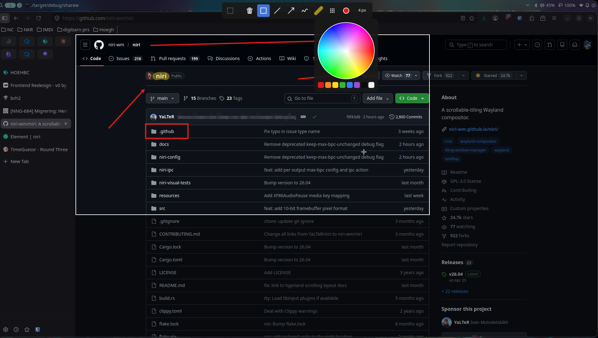

# shareW

A fast, keyboard-driven screenshot **annotation** tool for Wayland.



shareW freezes your screen as a dim overlay, lets you crop a region and draw on it —
rectangles, lines, arrows, freehand, highlighter, and pixelate/blur — then saves it to disk
or copies it to the clipboard. It spans all your monitors as a single canvas, and the toolbar
follows your mouse to whichever monitor you're on.

## Features

- Tools: crop region, rectangle, line, arrow, freehand pen, highlighter, blur (pixelate)
- Color picker (HSV wheel + preset swatches) and adjustable stroke thickness
- One canvas across all monitors; the toolbar follows the active monitor
- Save to `~/Pictures/Screenshots/` or copy straight to the clipboard
- Captures via `wlr-screencopy`, overlays via `wlr-layer-shell` — no external screenshot binary

## Keybindings

| Key | Action | | Key | Action |
|-----|--------|-|-----|--------|
| `c` | crop region | | `Space` / `Enter` | save to disk |
| `r` | rectangle | | `Ctrl`+`C` | copy to clipboard |
| `l` | line | | `Ctrl`+`Z` | undo |
| `a` | arrow | | `e` | clear all |
| `f` | freehand | | `-` / `+` | thickness |
| `h` | highlighter | | scroll wheel | thickness |
| `b` | blur | | `Esc` | cancel |

Drag to draw or to select a crop region. Click the color / thickness buttons for their popups.

## Build & run

```sh
cargo build --release
./target/release/sharew
```

Bind it to a key in your compositor (e.g. niri):

```kdl
binds {
    Print { spawn "/path/to/sharew"; }
}
```

## Requirements

A Wayland compositor that implements `wlr-layer-shell` and `wlr-screencopy`
(niri, Sway, Hyprland, river, …), plus `wl-clipboard` for clipboard copy.

## Status

Early and rough around the edges. Known limitations: assumes a uniform scale across outputs.

## Related projects

- [Flameshot](https://github.com/flameshot-org/flameshot)
- [Satty](https://github.com/gabm/satty)
- [Wayscriber](https://github.com/search?q=wayscriber&type=repositories)
